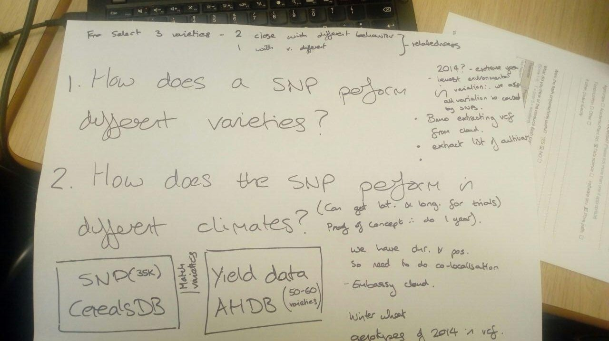
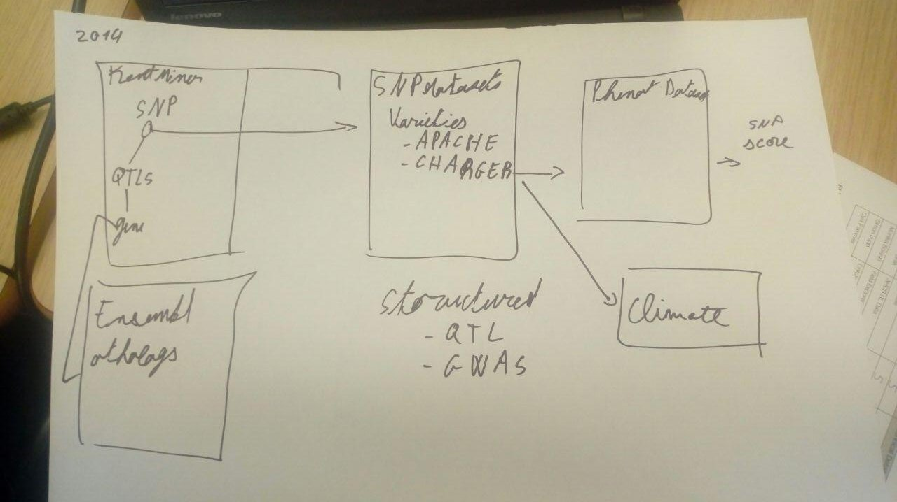

# Team 3

This document describes the work of team 3 :
+ Cyril Pommier, INRA
+ Giulia Arsuffi, Sainsbury Laboratory
+ Anna Backhaus, John Innes Centre
+ Keywan Hassani-Pak, Rothamsted Research
+ Sally Elizabeth Gibbs
+ Bruno Contreras Moreira, EMBL-EBI

## What was our challenge?

To speed up the post GWAS analysis - from markers to genes.

We obtained yield data for 2014 from the [AHDB recommended list](https://cereals.ahdb.org.uk) of winter wheat, 
as climatic variation was smaller in this year than in other years (Bastiaan, personal communication).   

## Analysis of SNP variation between two UK elite winter wheat varieties

In order to discover markers of interest we used SNP data from [cerealsDB](http://www.cerealsdb.uk.net/cerealgenomics/CerealsDB/indexNEW.php) 
for two winter wheat varieties: **Solstice** and **Skyfall**. This VCF file was provided by Paul Wilkinson from U.Bristol/CerealsDB.
It includes variant calls produced with a 35K chip for over 6K wheat varieties, several of them duplicated.
These are deliberately selected varieties that were on the AHDB list for which we also have yield data, so that this particular trait could be analysed later. The analysis returns all markers for which there is a polymorphism between the two lines (therefore on the side also estimating how genetically similar the lines are). 
We wanted to see which genetic sequences are still showing variation even though they were selected for very similar conditions and also perform very similar across all field conditions. Between Skyfall and Solstice the analysis found 5,816 polymorphic markers. The pitfall is that markers found to be polymorphic between the two lines might just not be of any relevance for phenotype. Moreover, markers falling into intergenic regions were excluded. The first 100 such SNPs were output in a VCF file. 

For each SNP of the VCF file you get from [Ensembl Plants](http://plants.ensembl.org) all the effects on all affected genes and pulls out gene ids. The gene ids are subsequently get passed into [KnetMiner](http://knetminer.rothamsted.ac.uk/) to search public literature, GWAS experiments, Ensembl homology data for known links between gene and a trait ('yield OR grain' in this case). The demo returns a ranked list of the genes based on the KnetScore and a link which helps the user explore all that related information.

**Benefits**: little computing power, only requires data that has already been collected. Low cost to implement. You don’t need to knock out or use a GM approach which is time consuming, you are tapping into natural variation.

Ideally we would want to incorporate climate data into the analysis. To this end we managed to get hold of the coordinates for the field trial locations and we put these into the Agrimetrics database. Agrimetrics had data for 17 out of the 27 field trial locations, but didn’t go back as far as 2014. With more time we would rerun this analysis using 2015 yield data and incorporating the environmental factors into the model.

## Which data we used

* [CerealsDB](http://www.cerealsdb.uk.net/cerealgenomics/CerealsDB/indexNEW.php) SNP data
* [AHDB](https://cereals.ahdb.org.uk) yield data
* [Ensembl plants](http://plants.ensembl.org)
* [KnetMiner](http://knetminer.rothamsted.ac.uk)

## Demo

Runnin the [demo.txt](demo.txt) takes about 6 minutes and should produce the following output files:
+ [Solstice.Skyfall.100.vcf](./Solstice.Skyfall.100.vcf)
+ [affectedGenes.tsv](./affectedGenes.tsv)
+ [scores.tab](./scores.tab)

The first lines of the last one are shown below:

| Ensembl Plants gene | gene name | KnetScore | KnetMiner URL |
| ------------------- | --------- | --------- | ------------- |
| [TRAESCS1A02G173400](http://plants.ensembl.org/Triticum_aestivum/Gene/Summary?g=TRAESCS1A02G173400) | MSBP1 | 64.41 | [TRAESCS1A02G173400&keyword=yield+grain](http://knetminer.rothamsted.ac.uk/wheatknet/genepage?list=TRAESCS1A02G173400&keyword=yield+grain) |
| [TRAESCS4B02G293600](http://plants.ensembl.org/Triticum_aestivum/Gene/Summary?g=TRAESCS4B02G293600)	| PAA2 |	33.27	| [TRAESCS4B02G293600&keyword=yield+grain](http://knetminer.rothamsted.ac.uk/wheatknet/genepage?list=TRAESCS4B02G293600&keyword=yield+grain)|
| [TRAESCS6A02G024400](http://plants.ensembl.org/Triticum_aestivum/Gene/Summary?g=TRAESCS6A02G024400)	| TRAESCS6A02G024400	| 30.92 | [TRAESCS6A02G024400&keyword=yield+grain](http://knetminer.rothamsted.ac.uk/wheatknet/genepage?list=TRAESCS6A02G024400&keyword=yield+grain) |

